# SFND 3D Object Tracking

This repository reports the final project of the camera module of the Udacity Sensor Fusion nanodegree program. 
The project leverage the knowledge on keypoint detectors, descriptors, and methods to match them between successive images that have been studied in the module.
Nevertheless the YOLO neural network in the OpenCv framework is used to detect car and truck in the image sequence.
The detection is used to associate regions in a camera image with Lidar points in 3D space. In the figure below the program schematic is reported.


## Program structure
With reference to the picture the main step of the program are:
1. **LOAD IMAGE INTO BUFFER**: for each timestamp at most 2 images are loaded into a circular buffer in order to limit the memory usage. The buffer is implemented using a std::list.
2. **DETECT & CLASSIFY OBJECTS**: a custom ObjectDetector class is used. On lane 57 the detector is initialized by passing the path of the pre-trained weights and configuration of a dnn base detector (i.e. yolo). Using this weights in the loop on the image sequence the detector detects cars and trucks. On average the detection process on the selected image sequences extracted from the KITTI dataset takes 0.3 sec for each frame.
<center>
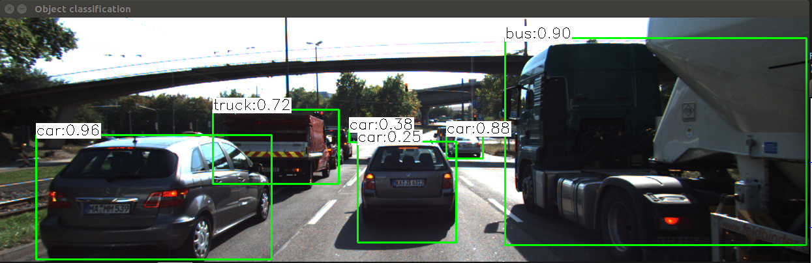
</center>

3. **CROP LIDAR POINTS**: [here](src/FinalProject_Camera.cpp#L161) the ```cropLidarPoints``` function is used to crop the 3D pointcloud and keep only the interesting region in front of the ego-car. In order to remove the ground plane the z value of points is cropped between -1.5 m and -0.9 m and to keep only the points belonging to the cars in front of the ego-vehicle the x values belongs to the interval [-2.0 , 2.0]. Nevertheless the intensity of the laser beam is controlled to access the reliability of the point coordinate and if is below 0.1 the point is discarded. Although cropping is not the best strategy that can be adopted here it is very fast and it takes less than 2 ms for each pointcloud. A more elegant approach for filtering the ground from the pointcloud can be to use RANSAC base plane filtering.

4. **CLUSTER LIDAR POINT CLOUD**: the points of the cropped pointcloud are assigned to the detected objects in the image plane[here](src/FinalProject_Camera.cpp#L173) . This is possible knowing the intrinsic and extrinsic calibration of the camera and lidar. Inside ```clusterLidarWithROI``` function the lidar point are projected into the camera image using the pinhole camera model. Once the point is projected on the image plane it is easy to check if it is part of one of the detected object (i.e. if it is contained in one of the detected object boundingbox). This process is very fast and on average it takes less then 1 ms.
<center>
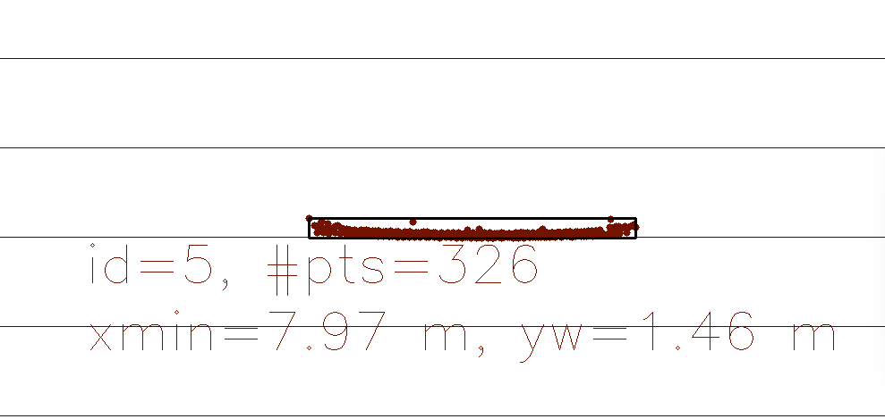
</center>

5. **DETECT KEYPOINTS**: the first step in order to compute the TTC from the camera image is to detect keypoints belonging to the surrounding cars. To speed up the process avoiding to re-initialize the detector each time the initialization and keypoint computation are separated. In particular the initialization can be found [here](src/FinalProject_Camera.cpp#L57) and the keypoint detection can be found [here](src/FinalProject_Camera.cpp#L197). The supported detectors are BRISK, BRIEF, ORB, FREAK, AKAZE, SIFT and the detection time it is strongly related with the selected detector.

6. **EXTRACT DESCRIPTORS**: in this step at each keypoint is associated a descriptor. Similar to keypoints detection this procedure is divided in an initialization step ([here](src/FinalProject_Camera.cpp#L60)) exectured only once and a per frame extraction step ([here](src/FinalProject_Camera.cpp#L222)). The supported descriptors are BRISK, BRIEF, ORB, FREAK, AKAZE, SIFT.
<center>
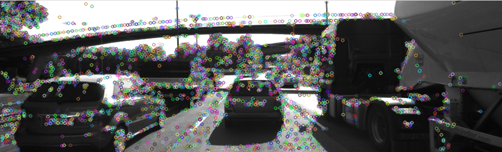
</center>

7. **MATCH KEYPOINT DESCRIPTORS**: the descriptor of the actual and previous images are matched and correspondence between the 2 images are found. The supported matcher type are the Brute-Force matcher (MAT_BF) and the Fast Approximate Nearest Neighbor (FLANN). Nevertheless on top of these matcher the best candidate can be selected using the nearest neighbor approach (best match) or evaluating the ratio of the matching distance between the best 2 matching neighbor. An high ratio means that the best matching neighbor is sensibly better than the second best.
<center>
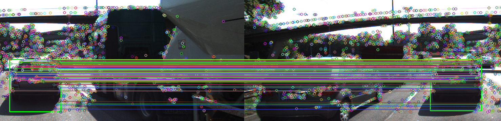
</center>

8. **TRACK 3D OBJECT BOUNDING BOXES**: to have a coherent identification of the bounding boxes in time, correspondence between actual and previous bounding box is extracted. Here a simple policy is adopted consisting in connecting the bounding box comparing the detected object, the actual area and the area overlap.

9. **LIDAR TTC computation**: disposing of the clustered lidar data corresponding to the preceding vehicle relative to the current and the previous time it is possible to estimate the relative speed of the preceding vehicle and its distance. Knowing this 2 values it is easy to estimate the time of collision. The estimation of the velocity is very noisy since we have to divide the difference between the current and the previous distance by the small discretization time. As a result a small error on the distance estimation that can be generated from the presence of outlayers can lead to a wrong estimation of the TTC.

10. **CAMERA TTC computation**: 
By computing the ration between the distance of keypoint in the actual image with the same distance computed in the previous image it it possible to estimate the time to collision. To have an accurate estimation it is very important to remove all the oultlayers. This is done by removing all the matching pairs that do not belong to the same bounding box and by computing the time to collision only using the median value.

<center>
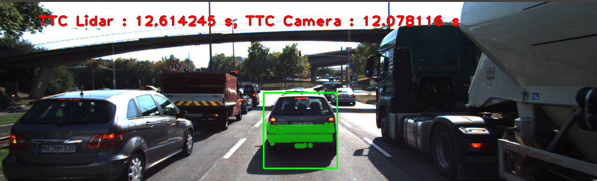
</center>

## Performance Evaluation 1
In order to estimate the time to collision from lidar data it is foundamental to compute the current relative speed. This can be done by subtracting the measured distance at current time by the distance measured at previous time and dividing by the frequency of the measure. The measure are taken at 10 Hz therefore small error in the estimation of the difference of distance became a relevant error in the speed estimation and therefore in TTC estimation.
In the most simple implementation the distance of the preceding vehicle is estimated considering the closer point of the poincloud. This procedure is sensible to outlayers.
As can be seen in the following picture an outlayer in the current (right) laser measurement causes the estimation of a wrong TTC of 3.8 seconds.
<center>
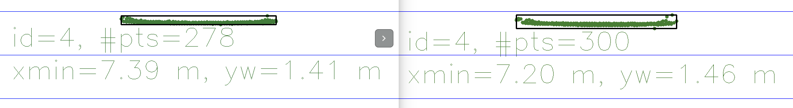
</center>
<center>
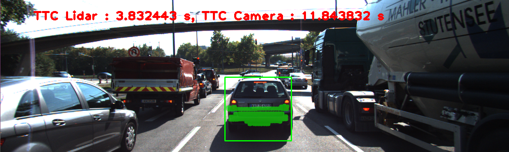
</center>
The same outlayer but one timestep later will lead to estimate a overconfident TTC, since the outlayer make us belive that the car in the previous step was closer than really are and therefore comparing this distance with the current distance make us believe that the ego-car is not closing the gap with the preceding vehicle.
<center>
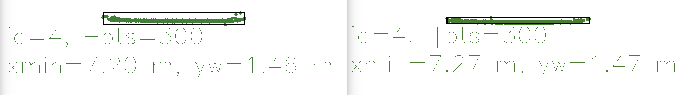
</center>
<center>
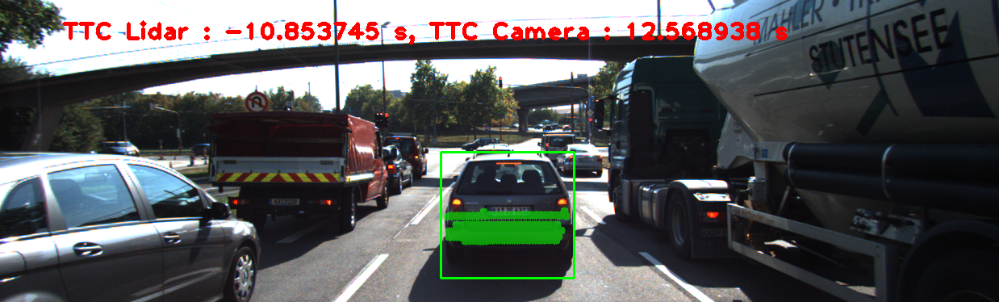
</center>

This error can be mitigated by using estimation metrics for distance estimation more robust to noise like for example the median value of the points and this is particularly important in computing the relative speed of the cars. Other more complex techniques can fit a model of the car on the detected points to get a more precise estimation of the distance.

## Performance Evaluation 2
In the following image it is reported the difference between the predicted TTC from camera and the TTC computed from the lidar measurement (using median as distance metrics to enhance the robustness to noise) ordered by the value of their standard deviation.
<center>
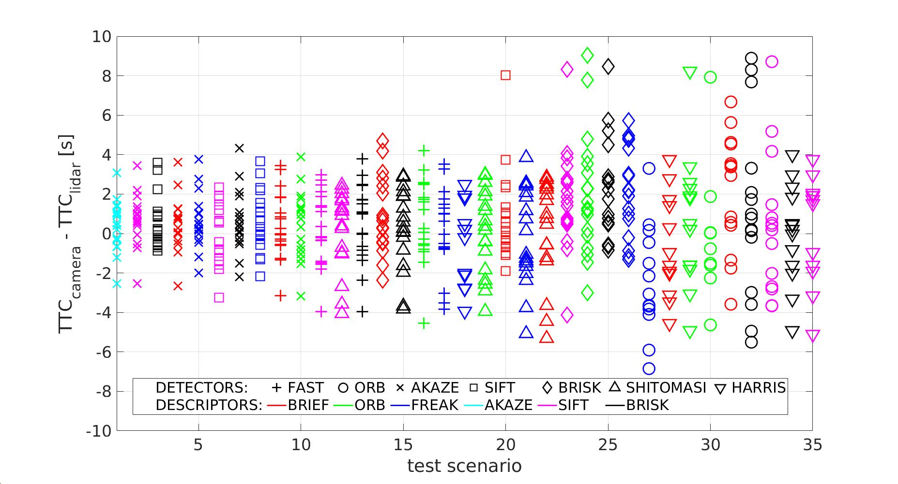
</center>
AKAZE, SIFT and FAST detectors show a better performance among the different tested detectors. In particular the difference of the TTC estimated from the camera with the one estimated from the lidar data is around 1.5 seconds. Note that this 1.5 seconds is not the standard deviation of the TTC measured by the camera but is the combined standard deviation of lidar and camera TTC (the sum of the TTCs' covariance).
We propose now a comparison of ORB-BRIEF with AKAZE-AKAZE detector-descriptor. The first image shows how ORB keypoints are concentraded only in the top part of the image, while in the second image we can see how the AKAZE keypoints are spread better inside the car bounding box. Disposing of more spread keypoints enable to have more heterogeneous estimation of the ratio of the distance between keypoint producing a more robust distribution.
<center>

</center>
<center>
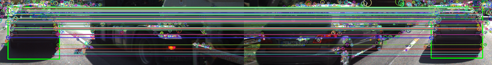
</center>

## Dependencies for Running Locally
* cmake >= 2.8
  * All OSes: [click here for installation instructions](https://cmake.org/install/)
* make >= 4.1 (Linux, Mac), 3.81 (Windows)
  * Linux: make is installed by default on most Linux distros
  * Mac: [install Xcode command line tools to get make](https://developer.apple.com/xcode/features/)
  * Windows: [Click here for installation instructions](http://gnuwin32.sourceforge.net/packages/make.htm)
* OpenCV >= 4.1
  * This must be compiled from source using the `-D OPENCV_ENABLE_NONFREE=ON` cmake flag for testing the SIFT and SURF detectors.
  * The OpenCV 4.1.0 source code can be found [here](https://github.com/opencv/opencv/tree/4.1.0)
* gcc/g++ >= 5.4
  * Linux: gcc / g++ is installed by default on most Linux distros
  * Mac: same deal as make - [install Xcode command line tools](https://developer.apple.com/xcode/features/)
  * Windows: recommend using [MinGW](http://www.mingw.org/)

## Basic Build Instructions

1. Clone this repo.
2. Find and download `yolov3.weights` online and paste inside `dat/yolo`
3. Make a build directory in the top level project directory: `mkdir build && cd build`
4. Compile: `cmake .. && make`
5. Run it: `./3D_object_tracking`.